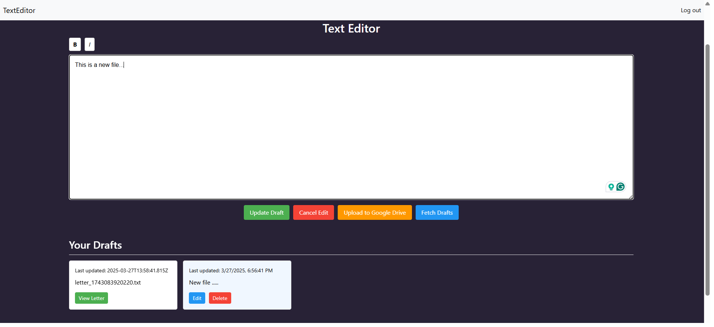

# TextEditor

## Overview
This app is a text editor with Google authentication that allows users to create, save, and manage drafts locally or upload them to Google Drive. It supports rich text formatting and ensures drafts persist across sessions using local storage or backend integration.

## Features
- Google authentication for secure login.
- Create, save, and manage drafts locally.
- Upload drafts to Google Drive for cloud storage.
- Rich text formatting options for enhanced editing.
- Persistent drafts using local storage or backend integration.
- Cross-session draft management.
- User-friendly interface for seamless text editing.
- Offline support for local draft management.
- Integration with Google Drive for easy access and sharing.
- Responsive design for use on various devices.

## Installation
1. Clone the repository:
    ```bash
    git clone https://github.com/itsAnjanaMourya/TextEditor.git
    ```
2. Navigate to the project directory:
    ```bash
    cd asmt_project
    ```
3. Install dependencies:
    ```bash
    [insert installation command, e.g., npm install]
    ```

## Usage
1. Start the application:
    ```bash
    [insert start command, e.g., npm start]
    ```
2. Open your browser and navigate to:
    ```
    http://localhost:[port]
    ```

## Contributing
Contributions are welcome! Please follow these steps:
1. Fork the repository.
2. Create a new branch:
    ```bash
    git checkout -b feature-name
    ```
3. Commit your changes:
    ```bash
    git commit -m "Add feature-name"
    ```
4. Push to the branch:
    ```bash
    git push origin feature-name
    ```
5. Open a pull request.

## Preview Link to the Website 🚀  
[](https://drive.google.com/drive/u/0/folders/1AyBMY_BlhmErXq6HVCklnGpqeQGDF_Kv)
